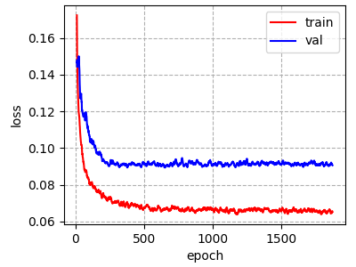

# Spatially Resolved Tumor Purity Maps (SRTPMs)

[](https://zenodo.org/badge/latestdoi/383730935)

This repository is the official implementation of [Obtaining Spatially Resolved Tumor Purity Maps Using Deep Multiple Instance Learning In A Pan-cancer Study](https://paper_link). 

We have developed a deep learning-based multiple instance learning (MIL) model predicting tumor purity of a sample from its H&E stained digital histopathology slides. The model's predictions are consistent with genomic tumor purity values, which are computationally inferred from genomic data and accepted as the golden standard. Furthermore, we have obtained spatially resolved tumor purity maps using the trained model to better understand the tumor microenvironment, a primary determinant of therapeutic response.

We have successfully tested our MIL models on eight different cohorts in The Cancer Genome Atlas (TCGA) and a local Singapore cohort. For all cohorts, we use the same model architecture. Here, we will go through the TCGA LUAD cohort, yet it applies to all.

Folder structure:

```console
SRTPMs
├── _filtered_manifest_files
│	├── gdc_manifest__BRCA__filtered.txt
│	├── gdc_manifest__GBM__filtered.txt
│	├── gdc_manifest__KIRC__filtered.txt
│	├── gdc_manifest__LGG__filtered.txt
│	├── gdc_manifest__LUAD__filtered.txt
│	├── gdc_manifest__LUSC__filtered.txt
│	├── gdc_manifest__OV__filtered.txt
│	├── gdc_manifest__PRAD__filtered.txt
│	├── gdc_manifest__THCA__filtered.txt
│	├── gdc_manifest__UCEC__filtered.txt
│	└── tcga_cohorts__patient_ids__slide_ids.xlsx
├── _images
├── LUAD
│	├── Images
│	├── WSIs
│	├── dataset
│	├── mil_dpf_regression
│	├── pre_processing
│	├── prepare_dataset
│	└── tcga_data
├── README.md
└── requirements.txt
```

We will explain the following steps one-by-one:

* [Required Python Packages](#required-python-packages)
* [Collecting TCGA Data](#collecting-tcga-data)
	* [Download Whole Slide Images (WSIs)](#whole-slide-images-wsis)
	* [Download Slide and Analyte Info](#slide-and-analyte-info)
* [Pre-processing](#pre-processing)
	* [Obtain WSI paths, WSI IDs, and Patient IDs](#wsi-paths-wsi-ids-and-patient-ids)
	* [Construct Tissue Masks and Crop Patches](#tissue-masks-and-patch-cropping)
* [Prepare Dataset](#prepare-dataset)
* [Multiple Instance Learning Model](#multiple-instance-learning-model)
	* [Training](#training)
	* [Predicting Sample-level Tumor Purity](#predicting-sample-level-tumor-purity)
		* [Performance Analysis and Statistical Tests](#performance_analysis_and_statistical_tests)
	* [Predicting Slide-level Tumor Purity](#predicting-slide-level-tumor-purity)
		* [Statistical Tests](#statistical_tests)
	* [Obtaining Spatial Tumor Purity Maps](#obtaining-spatial-tumor-purity-maps)

## Required Python Packages

All the experiments were run in a virtual environment created with pip on a Linux machine.

To install requirements:

```console
pip install -r requirements.txt
```


## Collecting TCGA Data

This part explains downloading (i) whole slide images (WSIs) and (ii) files containing information about slides and analytes from [TCGA data portal](https://portal.gdc.cancer.gov).

### Whole Slide Images (WSIs)

We download the manifest file and filter out the slides of samples that have genomic tumor purity values obtained from genomic data using [ABSOLUTE](https://www.nature.com/articles/nbt.2203). We present the filtered manifest file within "WSIs" folder. Note that filtered manifest files for all cohorts are given inside "\_filtered_manifest_files" folder in the main directory.

```console
WSIs
└── gdc_manifest__LUAD__filtered.txt
```

We download the slides by using [gdc-client](https://gdc.cancer.gov/access-data/gdc-data-transfer-tool):

```console
gdc-client download --manifest gdc_manifest__LUAD__filtered.txt
```

Final content of the folder:

```console
WSIs
├── gdc_manifest__LUAD__filtered.txt
├── 225f3bad-a221-44fc-9409-373cece21bd8
│	├── logs
│	└── TCGA-05-4244-01A-01-TS1.6c46d8c3-d7b4-4513-af31-9170244d60a7.svs
├── b79109c9-b3ce-4f4d-bce4-0fae9c49cf2d
│	├── logs
│	└── TCGA-05-4244-01A-01-BS1.90f043f6-e8d5-4cfd-b4e7-84207bc499a6.svs
├── fe63d8b5-c173-45bd-9404-f89c49296641
│	├── logs
│	└── TCGA-05-4420-01A-01-TS1.ca743cbe-1c69-4096-97d6-1b83489d1b79.svs
├── 62786dda-fc84-4138-9b60-72d3448676d9
│	├── logs
│	└── TCGA-05-4420-01A-01-BS1.d5af72a1-39d5-4060-93ee-aafefce8622d.svs
...
```

### Slide and Analyte Info

We download the files "slide.tsv" and "analyte.tsv" from TCGA data portal, and put them into the "tcga_data" folder. 

Initial content of the folder:

```console
tcga_data
├── analyte.tsv
├── slide.tsv
├── analyze_tcga_pathologist_predictions.sh
├── collate_data_files.py
└── slide_level_to_sample_level.py
```

To obtain slide-level and sample-level percent tumor nuclei estimates of pathologists, we run:

```console
analyze_tcga_pathologist_predictions.sh
```

Final content of the folder:

```console
tcga_data
├── analyte.tsv
├── slide.tsv
├── analyze_tcga_pathologist_predictions.sh
├── collate_data_files.py
├── slide_level_to_sample_level.py
├── analyte_portion_submitter_ids.txt
├── slide_ids__percent_tumor_nuclei_estimates.txt
├── sample_id__slide_portion_ids__analyte_portion_ids.txt
├── slide_id__analyte_portion_id__percent_tumor_nuclei.txt
└── sample_id__analyte_portion_id__percent_tumor_nuclei.txt
```

Slide-level percent tumor nuclei estimates (slide_id__analyte_portion_id__percent_tumor_nuclei.txt):
```console
# slide_id	analyte_portion_id	percent_tumor_nuclei
TCGA-05-4244-01A-01-TS1	01	80.0
TCGA-05-4244-01A-01-BS1	01	80.0
TCGA-05-4420-01A-01-TS1	01	80.0
TCGA-05-4420-01A-01-BS1	01	75.0
...
```

Sample-level percent tumor nuclei estimates (sample_id__analyte_portion_id__percent_tumor_nuclei.txt):
```console
# sample_id	analyte_portion_id	percent_tumor_nuclei
TCGA-05-4244-01A	01	80.0
TCGA-05-4420-01A	01	77.5
...
```


## Pre-Processing

This part explains (i) obtaining WSI paths, WSI IDs, and patient IDs and (ii) constructing tissue masks and cropping patches.

Initial content of the folder:

```console
pre_processing
├── construct_wsi_path_and_patient_id_files.sh
├── pre_process.sh
├── tissue_mask_construction.py
└── crop_all_small_patches_over_tissue_mask.py
```

### WSI paths, WSI IDs, and Patient IDs

We update the full folder path WSI_DIR="/mnt/Tumor_Purity/LUAD/WSIs" in the shell script. Then, to obtain WSI paths, WSI IDs, and Patient IDs, we run: 

```console
construct_wsi_path_and_patient_id_files.sh
```

WSI paths of primary solid tumor samples (WSI_filelist_primary_solid_tumor):

```console
/mnt/Tumor_Purity/LUAD/WSIs/225f3bad-a221-44fc-9409-373cece21bd8/TCGA-05-4244-01A-01-TS1.6c46d8c3-d7b4-4513-af31-9170244d60a7.svs
/mnt/Tumor_Purity/LUAD/WSIs/b79109c9-b3ce-4f4d-bce4-0fae9c49cf2d/TCGA-05-4244-01A-01-BS1.90f043f6-e8d5-4cfd-b4e7-84207bc499a6.svs
/mnt/Tumor_Purity/LUAD/WSIs/fe63d8b5-c173-45bd-9404-f89c49296641/TCGA-05-4420-01A-01-TS1.ca743cbe-1c69-4096-97d6-1b83489d1b79.svs
/mnt/Tumor_Purity/LUAD/WSIs/62786dda-fc84-4138-9b60-72d3448676d9/TCGA-05-4420-01A-01-BS1.d5af72a1-39d5-4060-93ee-aafefce8622d.svs
...
```

WSI IDs of primary solid tumor samples (wsi_id_primary_solid_tumor):

```console
TCGA-05-4244-01A-01-TS1
TCGA-05-4244-01A-01-BS1
TCGA-05-4420-01A-01-TS1
TCGA-05-4420-01A-01-BS1
...
```

Patient IDs of primary solid tumor samples (patient_id_primary_solid_tumor):

```console
TCGA-05-4244
TCGA-05-4420
...
```

The same set of files are also obtained for solid tissue normal samples. Please note that patient id for a solid tissue normal sample is the same with the one for primary solid tumor sample (since they were collected from the same patient).

Final content of the folder:

```console
pre_processing
├── construct_wsi_path_and_patient_id_files.sh
├── pre_process.sh
├── tissue_mask_construction.py
├── crop_all_small_patches_over_tissue_mask.py
├── WSI_filelist_primary_solid_tumor
├── wsi_id_primary_solid_tumor
├── patient_id_primary_solid_tumor
├── WSI_filelist_solid_tissue_normal
├── wsi_id_solid_tissue_normal
└── patient_id_solid_tissue_normal
```

### Tissue Masks and Patch Cropping

To construct tissue masks showing the tissue regions in the slides (tissue_mask_construction.py) and crop patches over the tissue regions (crop_all_small_patches_over_tissue_mask.py), we run:

```console
pre_process.sh
```

Here is an example WSI, corresponding tissue mask and a few cropped pathces:

<!--  -->


Tissue mask folders and cropped patches folders are created inside "Images":

```console
Images
├── primary_solid_tumor_tissue_masks_level6
├── solid_tissue_normal_tissue_masks_level6
├── all_cropped_patches_primary_solid_tumor__level1__stride512__size512
└── all_cropped_patches_solid_tissue_normal__level1__stride512__size512
```

The cropped patches over the slides of a patient are stored in a folder named with the patient id inside cropped patches folder. A text file (cropped_patches_filelist.txt) storing the slide and location info of each cropped patch is also created within each patient folder. Besides, a global file (cropped_patches_info_patient_id_primary_solid_tumor_all.txt) containing the number of cropped patches for each patient is created in the main folder.

```console
all_cropped_patches_primary_solid_tumor__level1__stride512__size512
├── cropped_patches_info_patient_id_primary_solid_tumor_all.txt
├── TCGA-05-4244
│	├── cropped_patches_filelist.txt
│	├── 0.jpeg
│	├── 1.jpeg
│	├── ...
│	
├── TCGA-05-4420
│	├── cropped_patches_filelist.txt
│	├── 0.jpeg
│	├── 1.jpeg
│	├── ...
│
...
```

The number of patches cropped over the slides of each patient (cropped_patches_info_patient_id_primary_solid_tumor_all.txt):

```console
# patient_id	number_of_patches
TCGA-05-4244	921
TCGA-05-4420	783
...
```

The slide id from which a patch is cropped and location of the patch within the slide (TCGA-05-4244/cropped_patches_filelist.txt):
```console
# patch_id	wsi_id	mask_row	mask_col	bg_ratio
0	TCGA-05-4244-01A-01-TS1	16	32	0.5
1	TCGA-05-4244-01A-01-TS1	16	48	0.4
...
```

## Prepare Dataset

This part explains preparing machine learning dataset.

Content of the folder "prepare_dataset":

```console
prepare_dataset
├── compare_imaging_and_genomic_data.py
├── generate_5_fold_data.py
├── cropped_patches_info_patient_id_primary_solid_tumor_all.txt
├── cropped_patches_info_patient_id_solid_tissue_normal_all.txt
└── purity_ABSOLUTE.txt
```

The files containing number of patches for each patient are copied from the previous section and genomic tumor purity values are obtained from genomic data.

Genomic tumor purity values ("purity_ABSOLUTE.txt"):
```console
# patient_id	purity
TCGA-05-4244	0.44
TCGA-05-4420	0.59
...
```

We use the data of patients who have both imaging and genomic data. To obtain those patients, we run:

```console
python compare_imaging_and_genomic_data.py
```

This creates the dataset folder and info files for all patients:

```console
dataset
└── all_patches__level1__stride512__size512
	├── all_patients_info_file.txt
	└── all_patients_solid_tissue_normal_info_file.txt
```

Here is the info file for tumor samples (all_patients_info_file.txt):

```console
# patient_id	num_patches	purity_score	group_id
TCGA-05-4244	921	0.44	4
TCGA-05-4420	783	0.59	5
...
```

Then, to split the data into 5 folds **at patient-level**, we run:

```console
python generate_5_fold_data.py
```

Final content of the "dataset" folder:

```console
dataset
└── all_patches__level1__stride512__size512
	├── all_patients_info_file.txt
	├── all_patients_solid_tissue_normal_info_file.txt
	├── fold0_info_file.txt
	├── fold1_info_file.txt
	├── fold2_info_file.txt
	├── fold3_info_file.txt
	└── fold4_info_file.txt
```


## Multiple Instance Learning Model

We formulate tumor purity prediction as a MIL task such that a sample is represented as a bag of patches cropped from the sample's slides, and the sample's genomic tumor purity value is used as the bag's label. We train the model on the training set (fold0, fold1, and fold2), choose the best model based on the validation set (fold3), and finally tested on the unseen patients of the hold-out test set (fold4).

This section explains each step from training to testing the model. The python and shell scripts used in each step are listed in the corresponding section. Hyperparameters inside the scripts are set to the default values used in the paper.

### Training

Scripts used in this section:

```console
mil_dpf_regression
├── distribution_pooling_filter.py
├── resnet_no_bn.py
├── model.py
├── dataset.py
├── train.py
└── plot_loss.py
```

To train a model:
```console
python train.py
```

Metrics collected during training are written into "loss_data" folder and model weights are saved in regular intervals into "saved_models" folder.
```console
mil_dpf_regression
├── loss_data
│	├── loss_metrics__2020_12_04__15_36_52.txt
│	├── ...
│	
├── saved_models
│	├── model_weights__2020_12_04__15_36_52__10.pth
│	├── model_weights__2020_12_04__15_36_52__20.pth
│	├── ...
│
...
```

To plot loss curves:
```console
python plot_loss.py --data_file loss_data/loss_metrics__2020_12_04__15_36_52.txt --filter_size 10
```

Example loss curves:




### Predicting Sample-level Tumor Purity

For each sample, we create 100 bags from the sample's slides and obtain predictions from the trained model. Then, the average of 100 predictions is used as sample-level tumor purity prediction for that sample.

Scripts used in this section:
```console
mil_dpf_regression
├── dataset_patient.py
├── test_patient.py
└── collect_statistics_over_bag_predictions__sample_level.py
```

To obtain sample-level tumor purity predictions from a trained model:
```console
python test_patient.py --init_model_file saved_models/model_weights__2020_12_04__15_36_52__1660.pth
```

Metrics collected during inference are written into "test_metrics".
```console
mil_dpf_regression
├── test_metrics
	├── 2020_12_04__15_36_52__1660
		└── test
			├── TCGA-05-4426-01
			│	└── bag_predictions_TCGA-05-4426-01.txt
			├── TCGA-05-4433-01
			│	└── bag_predictions_TCGA-05-4433-01.txt
...
```

Example bag-level predictions for one patient in the test set (bag_predictions_TCGA-05-4426-01.txt):
```console
# bag_id	truth	pred
TCGA-05-4426-01_0	0.700	0.754
TCGA-05-4426-01_1	0.700	0.737
TCGA-05-4426-01_2	0.700	0.716
...
```

To obtain sample-level predictions:
```console
python collect_statistics_over_bag_predictions__sample_level.py --data_folder_path test_metrics/2020_12_04__15_36_52__1660/test
```

Collated bag-level predictions file, sample-level predictions file and scatter plots:
```console
mil_dpf_regression
├── test_metrics
	├── 2020_12_04__15_36_52__1660
		└── test
			├── bag_predictions_all_patients.txt
			├── bag_level_scatter_plot.png
			├── patient_predictions_mpp.txt
			├── patient_level_scatter_plot_mpp.png
...
```

Sample-level predictions (patient_predictions_mpp.txt):
```console
# patient_id	truth	pred
TCGA-05-4426-01	0.700	0.740
TCGA-05-4433-01	0.620	0.452
...
```

#### Performance Analysis and Statistical Tests

Scripts used in this section:
```console
mil_dpf_regression
├── collate__pathologists_estimates__mil_predictions.py
├── scatter_plot.py
└── statistical_tests__mil_predictions__pathologists.py
```


To collate pathologists' estimates and the MIL model's predictions:
```console
python collate__pathologists_estimates__mil_predictions.py --data_folder_path test_metrics/2020_12_04__15_36_52__1660/test
```

```console
mil_dpf_regression
├── test_metrics
	├── 2020_12_04__15_36_52__1660
		└── test
			├── sample_id__percent_tumor_nuclei__purity__mil_pred.txt
...
```

Collated file content (sample_id__percent_tumor_nuclei__purity__mil_pred.txt):
```console
# sample_id	percent_tumor_nuclei	truth	pred
TCGA-05-4382-01	0.700	0.210	0.384
TCGA-05-4389-01	0.750	0.480	0.549
...
```

To obtain scatter plots and performance metrics for MIL predictions and pathologists' estimates:
```console
python scatter_plot.py --data_folder_path test_metrics/2020_12_04__15_36_52__1660/test
```

Scatter plots and summary statistics files:
```console
mil_dpf_regression
├── test_metrics
	├── 2020_12_04__15_36_52__1660
		└── test
			├── patient_level_scatter_plot__mil.pdf
			├── patient_level_scatter_plot__pathologists.pdf
			├── summary_spearmann_corr_coeff_and_abs_err__mil.txt
			├── summary_spearmann_corr_coeff_and_abs_err__pathologists.txt
...
```

Scatter plot for MIL predictions (patient_level_scatter_plot__mil.pdf):


Scatter plot for pathologists' estimates (patient_level_scatter_plot__pathologists.pdf):


Summary statistics for MIL predictions (summary_spearmann_corr_coeff_and_abs_err__mil.txt):
```console
# rho	rho_lower	rho_upper	p_value	mean_abs_err	std_abs_err	median_abs_err	Q1_abs_err	Q3_abs_err
0.515	0.320	0.660	2.1e-07	0.132	0.109	0.112	0.060	0.175
```

Summary statistics for pathologists' estimates (summary_spearmann_corr_coeff_and_abs_err__pathologists.txt):
```console
# rho	rho_lower	rho_upper	p_value	mean_abs_err	std_abs_err	median_abs_err	Q1_abs_err	Q3_abs_err
0.255	0.036	0.448	1.5e-02	0.280	0.151	0.275	0.170	0.395
```

To statistically compare the performance of the MIL model's predictions and pathologists' percent tumor nuclei estimates in terms of correlation and absolute error with respect to genomic tumor purity values:
```console
python statistical_tests__mil_predictions__pathologists.py --data_folder_path test_metrics/2020_12_04__15_36_52__1660/test
```

Summary of statistical tests file:
```console
mil_dpf_regression
├── test_metrics
	├── 2020_12_04__15_36_52__1660
		└── test
			├── statistical_tests__mil__pathologists__summary.txt
...
```

Summary of statistical tests (statistical_tests__mil__pathologists__summary.txt):
```console
# Statistical tests to compare mil predictions vs. percent tumor nuclei estimates
##### comparing correlated correlation coefficients using method of Meng et al. 1991 #####
...
## Statistical test summary on correlation coefficients ##
# rho1	pval1	rho_lower1	rho_upper1	rho2	pval2	rho_lower2	rho_upper2	p_val
0.515	2.1e-07	0.320	0.660	0.255	1.5e-02	0.036	0.448	1.2e-02
##### comparing absolute errors using Wilcoxon signed-rank test #####
...
## Statistical test summary on absolute errors ##
# mean_abs_error1	std_abs_error1	median_abs_error1	Q1_abs_error1	Q3_abs_error1	mean_abs_error2	std_abs_error2	median_abs_error2	Q1_abs_error2	Q3_abs_error2	p_val
0.132	0.109	0.112	0.060	0.175	0.280	0.151	0.275	0.170	0.395	3.9e-09
```


### Predicting Slide-level Tumor Purity

For each slide, we create 100 bags and obtain predictions from the trained model. Then, the average of 100 predictions is used as slide-level tumor purity prediction.

Scripts used in this section:
```console
mil_dpf_regression
├── dataset_slide.py
├── test_slide.py
└── collect_statistics_over_bag_predictions__slide_level.py
```

To obtain slide-level tumor purity predictions from a trained model:
```console
python test_slide.py --init_model_file saved_models/model_weights__2020_12_04__15_36_52__1660.pth
```

Metrics collected during inference are written into "test_metrics_slide".
```console
mil_dpf_regression
├── test_metrics_slide
	├── 2020_12_04__15_36_52__1660
		└── test
			├── TCGA-05-4426-01A-01-BS1
			│	└── bag_predictions_TCGA-05-4426-01A-01-BS1.txt
			├── TCGA-05-4426-01A-01-TS1
			│	└── bag_predictions_TCGA-05-4426-01A-01-TS1.txt
...
```

Example bag-level predictions for one slide in the test set (bag_predictions_TCGA-05-4426-01A-01-BS1.txt):
```console
# bag_id	truth	pred
TCGA-05-4426-01A-01-BS1_0	0.700	0.724
TCGA-05-4426-01A-01-BS1_1	0.700	0.751
TCGA-05-4426-01A-01-BS1_2	0.700	0.712
...
```

To obtain slide-level predictions:
```console
python collect_statistics_over_bag_predictions__slide_level.py --data_folder_path test_metrics_slide/2020_12_04__15_36_52__1660/test
```

Collated bag-level predictions file, slide-level predictions file and scatter plots:
```console
mil_dpf_regression
├── test_metrics_slide
	├── 2020_12_04__15_36_52__1660
		└── test
			├── bag_predictions_all_slides.txt
			├── bag_level_scatter_plot.png
			├── slide_predictions_mpp.txt
			├── slide_level_scatter_plot_mpp.png
...
```

Slide-level predictions (slide_predictions_mpp.txt):
```console
# slide_id	truth	pred
TCGA-05-4426-01A-01-BS1	0.700	0.736
TCGA-05-4426-01A-01-TS1	0.700	0.741
...
```


#### Statistical Tests

Scripts used in this section:
```console
mil_dpf_regression
├── statistical_tests__using_two_slides_vs_one_slide.py
└── statistical_test__compare_top_bottom_slides_of_a_sample.py
```

To obtain statistics about slide-level predictions and to statistically compare predicting sample-level tumor purity using two slides together and using only one slide:
```console
python statistical_tests__using_two_slides_vs_one_slide.py --data_folder_path test_metrics_slide/2020_12_04__15_36_52__1660/test
```


Summary files for statistical tests:
```console
mil_dpf_regression
├── test_metrics_slide
	├── 2020_12_04__15_36_52__1660
		└── test
			├── abs_difference__between_slides_predictions__histogram.pdf
			├── statistical_test__using_two_slides_vs_one_slide__summary.txt
...
```

Histogram of absolute differences between top and bottom slides of samples (abs_difference__between_slides_predictions__histogram.pdf):


Summary of statistical tests (statistical_test__using_two_slides_vs_one_slide__summary.txt):
```console
##### slide-level prediction statistics and summary of statistical test #####
### abs_difference =  np.abs(slide_pred_arr0 - slide_pred_arr1) ###
mean_abs_difference: 0.100, std_abs_difference: 0.110, median_abs_difference: 0.059, Q1_abs_difference: 0.023, Q3_abs_difference: 0.125
### abs_error_sample = np.abs(truth_arr - sample_pred_arr) ###
### mean_abs_error_slides = (abs_error0 + abs_error1)/2 ###
### difference = abs_error_sample - mean_abs_error_slides ###
mean_abs_error_sample: 0.118, std_abs_error_sample: 0.102, median_abs_error_sample: 0.084, Q1_abs_error_sample: 0.050, Q3_abs_error_sample: 0.168
mean_mean_abs_error_slides: 0.138, std_mean_abs_error_slides: 0.102, median_mean_abs_error_slides: 0.121, Q1_mean_abs_error_slides: 0.067, Q3_mean_abs_error_slides: 0.181
wilcoxon test: statistic=178.000, p-value=3.7e-04
# mean_abs_error_sample	std_abs_error_sample	median_abs_error_sample	Q1_abs_error_sample	Q3_abs_error_sample	mean_mean_abs_error_slides	std_mean_abs_error_slides	median_mean_abs_error_slides	Q1_mean_abs_error_slides	Q3_mean_abs_error_slides	pvalue
0.118	0.102	0.084	0.050	0.168	0.138	0.102	0.121	0.067	0.181	3.7e-04
```


To statistically compare if top and bottom slides of a sample are different in tumor purity:
```console
python statistical_test__compare_top_bottom_slides_of_a_sample.py --data_folder_path test_metrics_slide/2020_12_04__15_36_52__1660/test
```

Summary files for statistical tests:
```console
mil_dpf_regression
├── test_metrics_slide
	├── 2020_12_04__15_36_52__1660
		└── test__processed
			├── statistical_test__compare_top_bottom_slides_of_a_sample__pvalues.txt
			├── pvalues__boxplot.pdf
...
```

Box plot of pvalues obtained from statistical tests (pvalues__boxplot.pdf):


Statistical tests' pvalues file (statistical_test__compare_top_bottom_slides_of_a_sample__pvalues.txt):
```console
# sample_id	p_val
TCGA-05-4382-01	2.2e-02
TCGA-05-4389-01	3.9e-18
TCGA-05-4420-01	3.9e-18
...
```


### Obtaining Spatial Tumor Purity Maps

We first extract features of patches in a slide using the trained "feature extractor module" of the MIL model. Then, for each patch location, we predict tumor purity over a region-of-interest (ROI) centered at that location using trained the "transformation module" on distributions estimated from the features of patches within the ROI. By repeating this step for all patches in the slide, we obtained a tumor purity map.

Scripts used in this section:
```console
mil_dpf_regression
├── distribution_pooling_filter.py
├── resnet_no_bn.py
├── model.py
├── dataset_patient_patch.py
├── extract_features.py
├── dataset_distribution_closest_patches.py
├── kde_np.py
├── get_purity_around_a_patch.py
└── obtain_purity_map_from_patch_scores.py
```

To exract patch features:
```console
python extract_features.py --init_model_file saved_models/model_weights__2020_12_04__15_36_52__1660.pth
```

Extracted features files:
```console
mil_dpf_regression
├── extracted_features
	├── 2020_12_04__15_36_52__1660
		└── test
			├── TCGA-05-4426-01
			│	└── extracted_features_TCGA-05-4426-01.txt
			├── TCGA-05-4433-01
			│	└── extracted_features_TCGA-05-4433-01.txt
...
```

To get purity scores over ROIs containing 16 closest patches around each patch:
```console
python get_purity_around_a_patch.py --init_model_file saved_models/model_weights__2020_12_04__15_36_52__1660.pth --num_instances 16
```

Patch score files:
```console
mil_dpf_regression
├── patch_scores__16
	├── 2020_12_04__15_36_52__1660
		└── test
			├── TCGA-05-4426-01A-01-BS1
			│	└── patch_scores_TCGA-05-4426-01A-01-BS1.txt
			├── TCGA-05-4426-01A-01-TS1
			│	└── patch_scores_TCGA-05-4426-01A-01-TS1.txt
...
```

Example patch score file (patch_scores_TCGA-05-4426-01A-01-BS1.txt):
```console
# row_id	col_id	score
32	144	0.7472
32	160	0.7868
32	176	0.8677
...
```

To get tumor purity maps:
```console
python obtain_purity_map_from_patch_scores.py --data_folder_path patch_scores__16/2020_12_04__15_36_52__1660/test
```

Example tumor purity map:
<!--  -->


